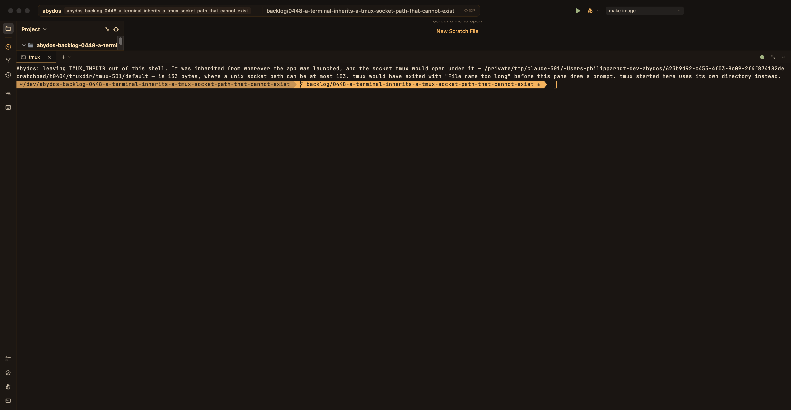

# 448. A terminal inherits a tmux socket path that cannot exist

Opening a terminal produced this, and nothing else:

    [process exited with status 1]
    error connecting to /private/tmp/claude-501/-Users-philipparndt-dev-abydos/
    623b9d92-…/scratchpad/t0404/tmuxdir/tmux-501/default (File name too long)

The pane is dead on arrival and the sentence is tmux's, not ours — so from the
outside it reads as the terminal being broken, with a path in it that has nothing
to do with the project somebody opened.

## What happened

A unix socket path on macOS is capped at about 104 bytes. That one is about 140.
`TMUX_TMPDIR` was set in the environment the app was launched from, the app hands
its environment to the shell it starts, and tmux appends `tmux-<uid>/default` to
whatever `TMUX_TMPDIR` says. Nothing between the launch and the failure looks at
whether the result can exist.

How the variable got there is not the app's fault and is worth recording anyway,
because it is the shape of the thing rather than a one-off: an agent ran
`export TMUX_TMPDIR=…` and `tmux new-session` in one command, that command
happened to *start* the default server, and tmux copies its global environment
into every pane it creates. So every shell on that machine carried it for the
next nine hours, and every Abydos launched from one of them inherited it.
Removed with `tmux set-environment -gu TMUX_TMPDIR`.

## Why this is ours to answer even though the value came from outside

The app already does exactly this for the neighbouring variable. 0440 found that
`$TMUX` leaked in from whatever shell launched the app, so a pane that was *not*
inside tmux wrapped its escapes in a passthrough nobody would unwrap and fell
back in silence — and `PseudoTerminal.mergedEnvironment` strips it. This is the
same family, one variable along, and the failure is louder but no more
explicable to the person looking at it.

A value that cannot produce a usable socket path is not a preference to be
honoured. It is a value to be refused, with a sentence saying so.

## What it says now

Also written to `~/Library/Logs/Abydos/tmux.log`, because the pane cannot be
relied on to keep it: the tab that attaches tmux runs `tmux new -A` as its first
command and tmux clears the screen the sentence was just written to. That was
watched happening — the first capture of this showed a healthy prompt and no
message at all.

## The number

103 bytes, not 104, and not "about 104". Measured on the way: the value in the
report was 116 bytes and the socket it implied 133, rather than the 140 estimated
above.

`sizeof(sun_path)` is 104 on macOS 26 — asked of the platform rather than
remembered, since it is a header's number and not one this app is entitled to
assume. The last byte belongs to the terminator: tmux writes the path with a
`strlcpy` into that field and treats a truncation as `ENAMETOOLONG`, so 104 bytes
of path is one too many for tmux even though the kernel takes the field filled to
its end. Both ends were bound by hand — a socket at 103 bytes binds, one at 104
is refused with `File name too long` — and that check is now a test, so a future
macOS that changes the field is caught by the suite rather than by somebody's
pane.

What tmux appends is `/tmux-<uid>/<label>`, where the label is `default` unless
`-L` says otherwise: seventeen bytes for uid 501. So a `TMUX_TMPDIR` has 86 to
spend, which was confirmed against tmux 3.7b — 86 starts a server, 87 fails with
the sentence from the report.

Two things about this were checked rather than reasoned about, and both changed
the code:

- **tmux measures the resolved path.** It calls `realpath` before it measures, so
  a 79-byte value under `/tmp` is refused: `/tmp` is a symlink to `/private/tmp`
  and eight bytes appear that were never typed. Arithmetic on what somebody wrote
  would have passed it.
- **Foundation's `resolvingSymlinksInPath` is not `realpath`.** Asked about
  `/private/tmp/x` it answers `/tmp/x` — it strips a leading `/private` whenever
  the shorter form also exists, which under `/tmp` it always does. That is eight
  bytes *under* what tmux measures, short in the one direction that matters, so
  it would have let through exactly the directories this is meant to catch.
  `realpath(3)` is used instead, resolving as far as the path exists and keeping
  the rest.

## Ruled out

- **Unsetting `TMUX_TMPDIR` whenever it is set.** The obvious fix and the wrong
  one: somebody with a short, valid one means it, and taking it away would put
  their panes on a different server from their other tools — the same class of
  mistake as ignoring somebody's PATH. The test is what the value produces, not
  whether it is there, and there is a test for each side.
- **Substituting a directory of our own.** Also rejected, for the same reason by
  another route. tmux has a default; putting a path of this app's choosing there
  would overrule the same choice, only less visibly. The variable is removed and
  tmux decides.
- **Assuming 104, or "about 104".** See above. The number the code needed was
  103, and the difference is a real directory that would have been refused for
  nothing.
- **`TMPDIR` as a second way in.** tmux 3.7b was tested with `TMPDIR` pointed at
  a scratch directory and put its socket under `/tmp` regardless, so only
  `TMUX_TMPDIR` and the compiled-in default are consulted. Nothing to do — but
  worth writing down, because macOS sets `TMPDIR` to a 49-byte per-app path and
  if tmux did consult it the margin would be thin.
- **Blanking it rather than removing it.** `TMUX_TMPDIR=""` is treated by tmux as
  unset, so it would work; removal is used anyway, to match what 0440 settled for
  `$TMUX` and so a shell asking whether the variable is set gets one answer
  rather than two spellings of no.

## What the survey found

The step asking whether anything else has this shape found the same variable in
five more places, and they fail worse than the pane did.

`TmuxMirror` (twice), `TerminalDirectory`, `TmuxConfig` and `ClaudeHookRunner`
each build a `Process` for tmux and none of them set an environment, so all five
inherited the value that could not work. Every one of them sends tmux's stderr to
the null device and turns a failure into `nil`, `false` or an empty list — so
where the pane at least died with a sentence in it, the tab strip showed nothing,
following a terminal stopped following, and no message was written anywhere. All
five are now given `TmuxSocketPath.environment`.

`$TMUX` does not rescue them, which was worth checking rather than assuming: with
both set, tmux still works its socket path out from `TMUX_TMPDIR`, so a client
already inside a session goes looking for the path that cannot exist just the
same.

Nothing else of this shape was found. The app creates no unix sockets of its own
— LSP and DAP are pipes — so there is no second instance of this failure. Two
near misses are worth naming for whoever looks next, neither touched here:

- `startLoginShell` reads `SHELL` and falls back only when it is absent, not when
  it is empty, so `SHELL=""` reaches `execve` and the pane says `[process exited
  with status 127]` with nothing about which shell. `UserShell.path` guards the
  empty case; this one does not.
- `LanguageServers.serverEnvironment` honours an inherited `JAVA_HOME` without
  looking at it, and a wrong one surfaces much later as jdtls failing to start.

## What the suite caught

Two things, both of which only happened because the machine this was written on
still had the 116-byte value in its shell — so the suite was running against the
very environment in the report.

- **Writing the log line where it was first put cost a pane its first output.**
  It sat between `forkpty` and the reader starting, and a file open, a size check
  and a close is long enough that `/bin/echo` had said its piece and closed the
  slave before anything was listening. `runsACommandAndCapturesOutput`, which had
  passed for a year, timed out after 128 seconds. The write is on a queue of its
  own now, and the same test takes 0.025 seconds. Worth remembering: nothing
  belongs between the fork and `startReading`.
- **`AbydosIcatTests` counts lines in a pane and inherits the machine's
  environment**, so it was counting the refusal as well as the picture. It
  already strips `TMUX` for exactly this reason; it now asks
  `TmuxSocketPath.honouringWhatFits` for the rest.

`ContainerLSPLiveTests` failed once mid-run and passed on its own and on the next
full run. Not touched by any of this — a jdtls container on a machine two other
agents were measuring on.

## Not proved

The sentence was seen in a real pane, and the refusal in the log, with the actual
116-byte value from the report still in the launching shell. What was not proved
is the behaviour of a pane whose tmux uses a non-default socket name: a pane free
to run `tmux -L <name>` is measured here against `default`, so a very long `-L`
could still overflow and a short one could be refused slightly too eagerly. That
is a prediction the app cannot make correctly, and erring towards the default is
the side that keeps panes alive.

## Steps

- [x] Work out the real limit rather than assuming 104: `sizeof(sun_path)` on
      this platform, less what tmux appends (`tmux-<uid>/` and the socket name)
- [x] Refuse a `TMUX_TMPDIR` whose socket path would not fit, and say so in the
      pane instead of letting tmux say "File name too long"
- [x] A short, valid `TMUX_TMPDIR` is still honoured — a test for both sides
- [x] Check whether anything else the app hands to a subprocess has the same
      shape: a value inherited, passed on, and only failing much later
- [x] Write down here what was ruled out on the way
- [x] `spec/terminal.md` says what the project now does
