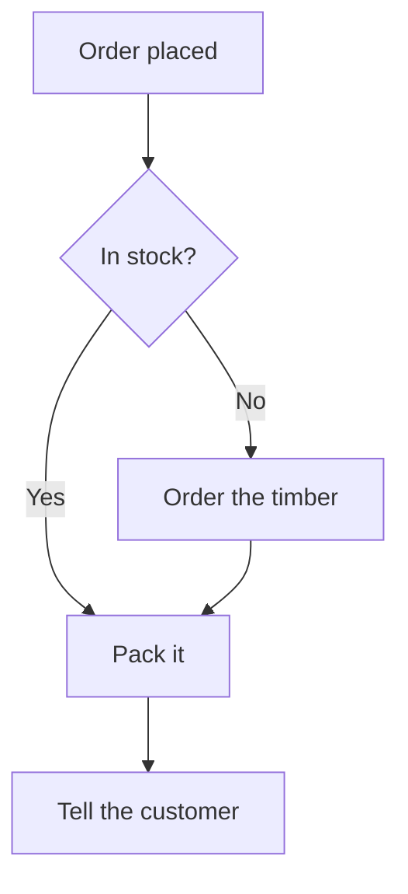
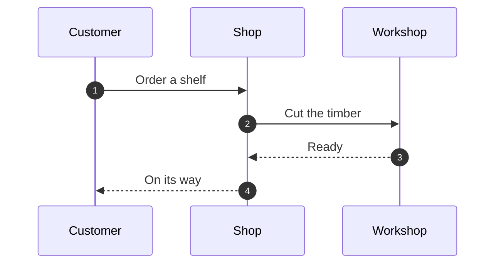
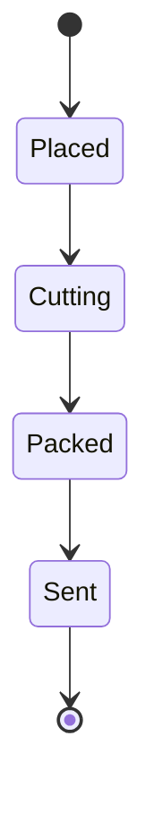

# Ordering a shelf

Three pictures, a table and a code block, so that a fence's neighbours are
exercised as well as the fence.

## What happens when an order arrives



## Who says what to whom

| Step | Who | How long |
|---|---|---:|
| Accept the order | Shop | 1 min |
| Cut the **timber** | Workshop | 2 h |
| Post it | Courier | 1 d |



## What the order itself is

```swift
struct Order {
    let part: String
    let quantity: Int
}
```

## The states an order goes through



That is the whole of it.
